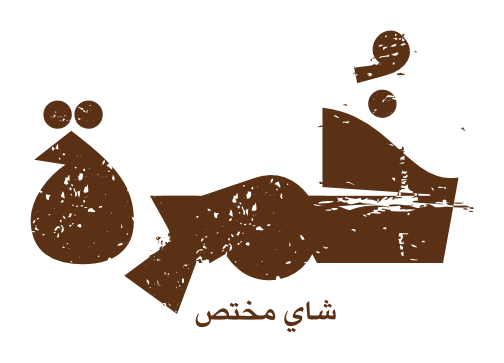

# خمرة · Khamra POS

A clean, premium point‑of‑sale for the **Khamra (خمرة) specialty‑tea booth**.
Bilingual (Arabic / English), works fully **offline**, and stores every sale
locally on the device — no internet, server, or install required.



---

## How to run

**Easiest:** double‑click `index.html` — it opens in your browser and works offline.

**Recommended for the booth — iPad mini** (tuned for it specifically):

1. Put the `Tea POS` folder online or on a small local server, e.g.:
   ```bash
   cd "Tea POS"
   python3 -m http.server 4173
   ```
2. Open it in **Safari** on the iPad, then **Share → Add to Home Screen**.
3. Launch it from the Home Screen icon — it runs **full‑screen** like a native
   app (no Safari bars).

Optimised for iPad mini in **both orientations**:
- **Landscape** → products grid + a fixed order panel (classic till layout).
- **Portrait** → products fill the screen with a slide‑up order sheet that
  shows the running total and a big Charge button.

Touch‑tuned: large tap targets, no accidental zoom, no rubber‑band scrolling,
and the layout respects the home‑indicator / status‑bar safe areas. To keep it
on one orientation, lock rotation in iPad Control Center.

> The very first time you open it online, the premium fonts download and cache.
> After that everything runs offline.

---

## Login

A PIN gate protects the till.

- **Default PIN: `123456`** (6 digits)
- Change it any time in **Settings → Security**. (The app warns you while the
  default PIN is still in use.)

---

## What it does

| Screen | What you get |
| --- | --- |
| **Sale** (نقطة البيع) | Tap products (with **photos**) to build an order, adjust quantities, take **Cash or Card**, and record the sale. |
| **Reports** (التقارير) | Today vs. all‑time **revenue**, order count, items sold, average order, a **7‑day revenue chart**, the **top‑selling product**, a best‑sellers ranking, and recent orders. The top seller only appears once one product genuinely leads — while sales are tied it shows *"no clear top seller yet."* |
| **Settings** (الإعدادات) | Switch language, change the PIN, edit menu items & prices, **add a real photo to each product**, and **export sales to CSV / back up to JSON / clear history**. |

### Product photos

Two ways to add real photos. Items without a photo fall back to a themed line
icon, and a missing file degrades gracefully (no broken images).

**1 · Drop files in a folder** (best for setting up all items at once)
Put JPGs in `assets/products/` named by item id — they appear automatically on
the next load:

| File | Item |
| --- | --- |
| `karak.jpg` | كرك خمرة · Khamra Karak |
| `red-tea.jpg` | شاي أحمر · Red Tea |
| `hibiscus-peach.jpg` | كركدية خوخ · Peach Hibiscus |
| `hibiscus.jpg` | كركدية · Hibiscus |
| `honeycomb.jpg` | خلية نحل · Honeycomb |
| `cinnabon.jpg` | سينابون · Cinnamon Roll |
| `croissant-butter.jpg` | كرواسون زبدة · Butter Croissant |
| `croissant-choc.jpg` | كرواسون تشوكلت · Chocolate Croissant |

(See `assets/products/README.txt` for the same list.)

**2 · Upload inside the app** (quick, per item)
**Settings → Menu** → tap the square next to an item to attach a photo from the
tablet/gallery. It's auto‑resized and saved on the device. Tap the **×** to remove.

Photos show on the sale buttons, the best‑sellers list, and the top‑seller card.

Currency is **Omani Rial (OMR)** shown to 3 decimals, with the **new OMR symbol**
displayed next to every price (cards, cart, totals, Charge button, reports). The
symbol lives at `assets/omr.svg` — replace that one file to update it everywhere.

---

## Menu (editable in Settings)

**المشروبات · Drinks** — كرك خمرة 0.500 · شاي أحمر 0.500 · كركدية خوخ 1.000 · كركدية 0.800
**السويتات · Sweets** — خلية نحل 1.000 · سينابون 1.000 · كرواسون زبدة 0.500 · كرواسون تشوكلت 0.600

---

## Where the data lives

All menu, settings, and sales are saved in the browser's **localStorage** on the
device — private and offline. To move data to another device, use
**Settings → Backup (JSON)**. Keep regular CSV/JSON exports as your safety net.

## Powered by Futureline.ai

The signature appears on the **lock screen** and at the **middle‑bottom of the
main (Sale) page**. It uses your official artwork via two image files (shown
automatically when present, with a recreated lockup as a temporary fallback):

| File | Used on |
| --- | --- |
| `assets/futureline-sign.png` | Main page (light background) — original colours, transparent bg |
| `assets/futureline-sign-light.png` | Lock screen (dark background) — light version for contrast |

Drop the original signature image into the project and these get generated from
it (background removed; a light variant for the dark lock screen).

## Files

```
index.html        app shell + icons
css/styles.css    theme & layout (tea palette)
js/data.js        storage, menu, currency, analytics, i18n
js/app.js         PIN gate, sale flow, reports, settings
assets/           brand logo (dark + light)
```
